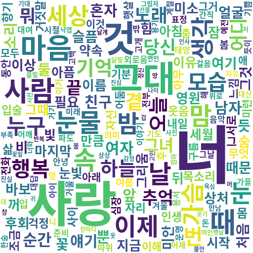
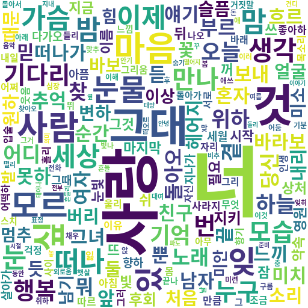
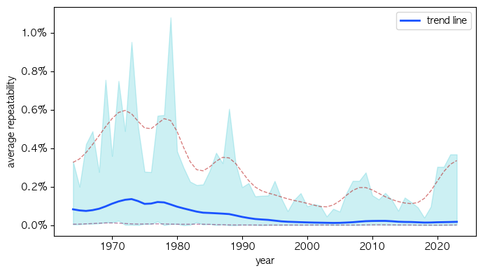

# 한국 가사 (1964~2023) 데이터 분석하기

1964년부터 2023년 사이의 MELON 연도별 TOP 100 노래를 대상으로, 가사에 등장한 자연어를 분석한다.

지난 60년 사이의 모든 국내 노래를 다루지는 못하지만, 데이터는 1,312명의 가수와 4,220개의 곡을 포함한다.

연도별 분석의 경우, 당해에 발매한 모든 곡을 분석하지는 않았으며 순위권에 없었던 노래는 누락되었음을 참고바란다.

## 품사별 빈도

|**한글 가사 전체 요약**|**한글 명사 요약**|
|:-:|:-:|
|||
|**한글 동사 요약**|**한글 형용사 요약**|
|||
|**한글 명사와 동사 요약**|**영어 가사 요약**|
|||

## 연도별 한/영 비율

## 연도별 가사 반복도

